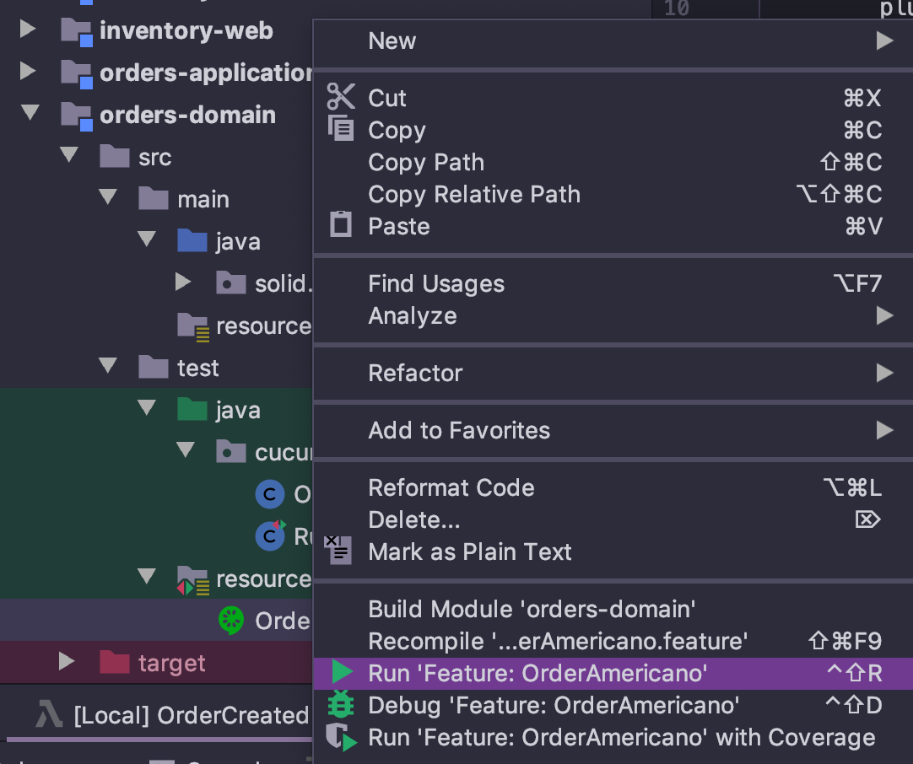
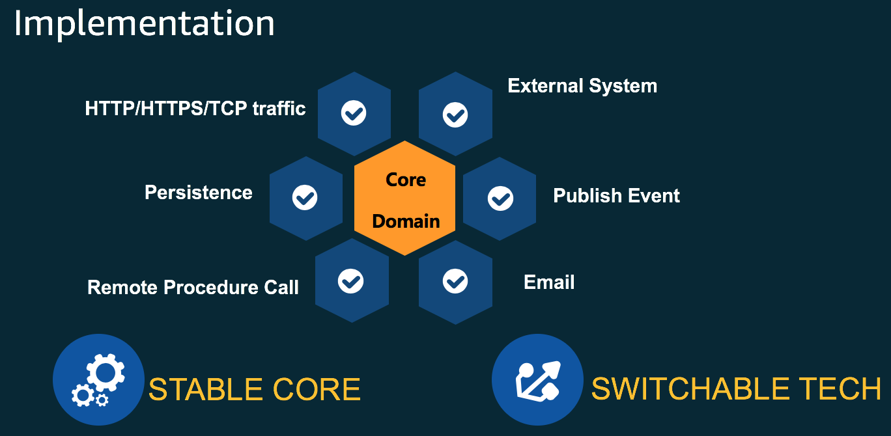
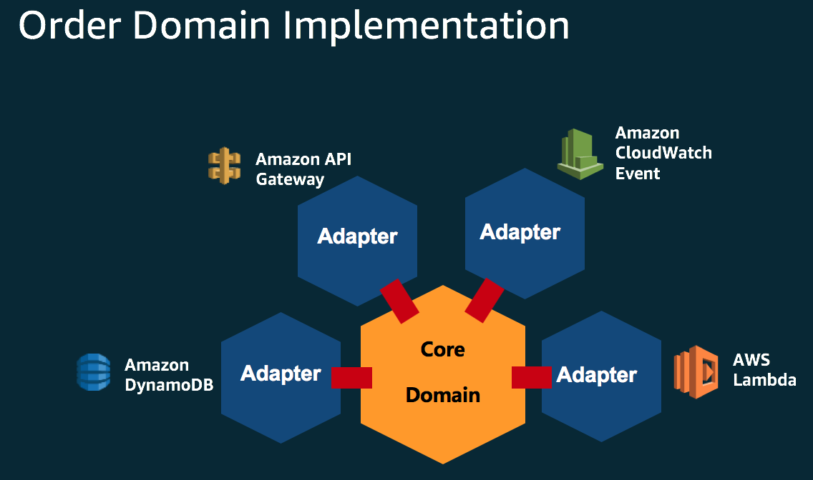

_[< back to 03 Roles, Commands and Event Mapping](../03-roles-commands-events-mapping/README.md)_

## Modeling and Development

Now, you have the whole story, bounded context and **just-enough** aggregates, commands, and events. It's time to develop domain model to proof crunched model is correct or not.

> Design & Develop model iteratively and incrementally is recommended, never to run this workshop in a waterfall style, that's spent lots of time but encounter uncontrollable surprise at last-minute.

### Specification by Example

```java
Feature: Order Americano in seat

  Scenario: Drink Americano here
    Given the price of a cup of Americano is 80
    When I order 2 cups of Americano
    And decided to have it Here
    And the order is established
    Then the total price should be 160
    And the coffee temperature should be 70 degree c


#    Examples:
#      | coffee    | quantity | price | HereToGo |
#      | Americano | 2        | 80    | true     |

```

Want to have concrete requirements scenario? **The only way is to talk about an example.**

A living doucment help team to collaborate in the same understanding by example.

Try to read the feature and scenario as above, all of the stakeholders could read and understand it, there is no technical term explained there, which is a good way to talk with stakeholder.

Team should co-work on these documents, once the examples confirmed, developers could leverage it to generate a unit test code skeleton, and implement it accordingly.


### TDD within Unit Test environment

In this workshop, cucumber-java is in used to run the example.

```java
package solid.humank.cucumberjunit;


import cucumber.api.CucumberOptions;

import cucumber.api.junit.Cucumber;
import org.junit.runner.RunWith;

@RunWith(Cucumber.class)
@CucumberOptions(
        features = "src/test/resources/features",
        glue = "solid.humank.steps"
)
public class RunCucumberTest {
}

```


### Generate unit test code skeleton




By running the cucumber-java steps, Java compiler complained that there are no implementation methods regarding **Feature: Order_Americao**.

You can implement missing steps with the snippets below:
```java
@Given("^the price of a cup of Americano is (\\d+)$")
public void the_price_of_a_cup_of_Americano_is(int arg1) throws Throwable {
    // Write code here that turns the phrase above into concrete actions
    throw new PendingException();
}

@When("^I order (\\d+) cups of Americano$")
public void i_order_cups_of_Americano(int arg1) throws Throwable {
    // Write code here that turns the phrase above into concrete actions
    throw new PendingException();
}

@When("^decided to have it Here$")
public void decided_to_have_it_Here() throws Throwable {
    // Write code here that turns the phrase above into concrete actions
    throw new PendingException();
}

@When("^the order is established$")
public void the_order_is_established() throws Throwable {
    // Write code here that turns the phrase above into concrete actions
    throw new PendingException();
}

@Then("^the total price should be (\\d+)$")
public void the_total_price_should_be(int arg1) throws Throwable {
    // Write code here that turns the phrase above into concrete actions
    throw new PendingException();
}

@Then("^the coffee temperatuere should be (\\d+) degree c$")
public void the_coffee_temperatuere_should_be_degree_c(int arg1) throws Throwable {
    // Write code here that turns the phrase above into concrete actions
    throw new PendingException();
}


Process finished with exit code 0

```

### Implement Domain Model from code Skeleton

It's a TDD style approach, way to fulfill Feature: Order_Americano steps.

```java
package solid.humank.steps;

import com.amazonaws.services.cloudwatchevents.AmazonCloudWatchEvents;
import com.amazonaws.services.cloudwatchevents.AmazonCloudWatchEventsClientBuilder;
import com.amazonaws.services.dynamodbv2.AmazonDynamoDB;
import com.amazonaws.services.dynamodbv2.AmazonDynamoDBClientBuilder;
import com.amazonaws.services.dynamodbv2.document.DynamoDB;
import cucumber.api.java.en.Given;
import cucumber.api.java.en.Then;
import cucumber.api.java.en.When;
import solid.humank.domains.Order;

import static org.junit.Assert.assertEquals;

public class OrderAmericanoTest {

    int priceOfAmericano;
    int orderCups;
    boolean isHere;
    int totalPrice;

    Order order;
    String orderString;

    final AmazonCloudWatchEvents cwe =
            AmazonCloudWatchEventsClientBuilder.defaultClient();

    final AmazonDynamoDB client = AmazonDynamoDBClientBuilder.defaultClient();
    final DynamoDB ddb = new DynamoDB(client);

    @Given("^the price of a cup of Americano is (\\d+)$")
    public void the_price_of_a_cup_of_Americano_is(int price) throws Throwable {

        priceOfAmericano = price;
    }

    @When("^I order (\\d+) cups of Americano$")
    public void i_order_cups_of_Americano(int cups) throws Throwable {
        orderCups = cups;
    }

    @When("^decided to have it Here$")
    public void decided_to_have_it_Here() throws Throwable {
        isHere = true;
    }

    @When("^the order is established$")
    public void the_order_is_established() throws Throwable {

        order = new Order("2c",true,"Americano",2,80);
        orderString = order.establish(cwe,ddb);

    }

    @Then("^the total price should be (\\d+)$")
    public void the_total_price_should_be(int sum) throws Throwable {
        assertEquals(sum,order.payAmount());
    }

    @Then("^the coffee temperatuere should be (\\d+) degree c$")
    public void the_coffee_temperatuere_should_be_degree_c(int degree) throws Throwable {
        assertEquals(degree, order.getDrinktemperature());
    }

}

```


## Running on AWS

> This workshop explained  is running on AWS. By using Lambda and cloudwatch event to present how can we keep model classes at the core, and leverage the outside adapter to interact with other domain

## Design each Microservices in Port-adapter concept



> The famous Port-Adapter pattern is the best suite for developing microservices. Focus on core domain problem, and switch any infrastructure or communication tools as you need.



> For this workshop demo, design a order domain object, and leverage AWS services to do persistent, http request accept and handler, and event propagation.

## Using Lambda function as the entry point

You can easily export a lambda function to accept the incomg command, and do some stuff.

## Using CloudWatch Event as the integration Event

If cross boundary event did occured in current domain, never call other domain service directly, just publish a cross-domain-event. On AWS, the most appropriate one is using CloudWatch Event, it's a near-real-time event, high performance and scalable.

## Using DynamoDB as the Write Model/ Read Model persistent Repository

Once capture Model with Domain Experts, you can design Write Model first, and create Query usage Read Model.

## Launch this workshop in Serverless Architecture


This workshop example explained a Coffee shop use case, go through a customer order coffee and barista accept the order then make coffee.

### Prerequisite

1. [Create a Lambda function Execution Role](https://docs.aws.amazon.com/lambda/latest/dg/intro-permission-model.html#lambda-intro-execution-role)
2. [Enable Amazon CloudWatch Logs for API Gateway](https://aws.amazon.com/premiumsupport/knowledge-center/api-gateway-cloudwatch-logs/)
3. [Install AWS CLI](https://aws.amazon.com/cli/)
4. [Install SAM CLI](https://github.com/awslabs/aws-sam-cli)
5. Get used to do Unit Test - mvn test
6. Prepare Java/Maven env by IDE or commandline
7. [Configuring the AWS CLI](https://docs.aws.amazon.com/cli/latest/userguide/cli-chap-getting-started.html)

### Deployment instructions

#### 01 - Define CloudWatchEvent for the Order-created Event

[Define CloudWatch Event for Coffee Order Created Event](/documents/01-define-cloudwatchevent/README.MD)

#### 02 - Deploy Order Domain lambda function with proxy integration on API Gateway

[Deploy Order Domain](/documents/02-deploy-order-domain/README.MD)

#### 03 - Deploy MakeUp Domain lambda function with proxy integration on API Gateway

[Deploy MakeUp Domain](/documents/03-deploy-makeup-domain/README.MD)

#### 04 - Experience and Test the Demo

[Experience Coffee order demo](/documents/04-experience/README.MD)


## Further Information

- Vernon, Vaughn. “Ch. 7, Event Storming.” Domain-Driven Design Distilled, Addison-Wesley, 2016. - https://www.amazon.com/Domain-Driven-Design-Distilled-Vaughn-Vernon/dp/0134434420
- Brandolini, Alberto. Introducing EventStorming. Leanpub, to be released, eventstorming.com/ - https://leanpub.com/introducing_eventstorming
- Brandolini, Alberto. “Ziobrando’s Lair.” Introducing Event Storming, Nov. 2013, ziobrando.blogspot.de/2013/11/introducing-event-storming.html.
- Brandolini, Alberto. Event Storming Recipes. SlideShare, 21 June 2014, de.slideshare.net/ziobrando/event-storming-recipes.
- Rayner, Paul. Event Storming. SlideShare, 26 May 2017, [www.slideshare.net/AgileDenver/event-storming-76390807](http://www.slideshare.net/AgileDenver/event-storming-76390807).
- Brandolini, Alberto. Model Storming. SlideShare, 19 Sept. 2013, [www.slideshare.net/ziobrando/model-storming](http://www.slideshare.net/ziobrando/model-storming).
- Brandolini, Alberto. 50.000 Orange Stickies Later, 7 November 2018, https://www.youtube.com/watch?v=NGXl1D-KwRI
- Business Rules, https://medium.com/plexiti/business-rules-367e430ee168
- How to use Example Mapping & Event Storming, https://hiptest.com/blog/bdd/how-to-use-example-mapping-event-storming/
- What is the Aggregate, https://twitter.com/mathiasverraes/status/1141242508892155904?s=20
- How to monitor Domain Events for Product management, https://xebia.com/blog/eventstorming-and-how-to-monitor-domain-events-for-product-management/


## Special Thanks For

**Jenson Lee** , plays the role as coffee shop owner

**Eason Kuo**, Core team member from Domain Driven Design Taiwan Community

**Arthur Chang** , collaborate design & run the workshop, Co-founder from Domain Driven Design Taiwan Community

**Kenny Baas-Schwegler** , discuss the aggregate definition and ES workshop running experience sharing

## TODO

- Split theis workshop into 3 module - Strategy Design, Tactical Design, Deployment on AWS
- Using AWS SDK for Java v2 to have better performance
- Try to use Dagger2 as the DI framework to have better cold start time
