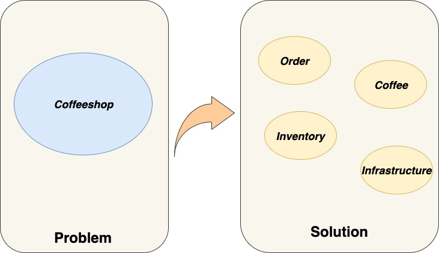

_[< back to 03 Roles, Commands and Event Mapping](../03-roles-commands-events-mapping/README.md)_

## Modeling and Development



Now, you have the whole story, bounded context and **just-enough** aggregates, commands, and events. It's time to develop domain model to proof crunched model is correct or not.

> Design & Develop model iteratively and incrementally is recommended, never to run this workshop in a waterfall style, that's spent lots of time but encounter uncontrollable surprise at last-minute.

### Specification by Example

```java
Feature: Order Americano in seat

  Scenario: Drink Americano, stay in
    Given customer wants to order coffee with the following detail
      | coffee    | quantity | price |
      | Americano | 2        | 80    |
    When the order is confirmed
    Then the total fee should be 160l


```

Want to have concrete requirements scenario? **The only way is to talk about an example.**

A living doucment help team to collaborate in the same understanding by example.

Try to read the feature and scenario as above, all of the stakeholders could read and understand it, there is no technical term explained there, which is a good way to talk with stakeholder.

Team should co-work on these documents, once the examples confirmed, developers could leverage it to generate a unit test code skeleton, and implement it accordingly.


### TDD within Unit Test environment

In this workshop, cucumber-java is in used to run the example.

```java
package cucumber;


import io.cucumber.junit.Cucumber;
import io.cucumber.junit.CucumberOptions;
import org.junit.runner.RunWith;

@RunWith(Cucumber.class)
@CucumberOptions(
        plugin = "json:target/cucumber-report.json",
        glue = "cucumber",
        features = "src/test/resources/")
public class RunCucumberTest {
}

```


### Generate unit test code skeleton


By running the cucumber-java steps, Java compiler complained that there are no implementation methods regarding **Feature: Order_Americao**.

Cucumber complained that all of these scenario were not implemented, you are encourged to imeplement this methods.

```java
You can implement missing steps with the snippets below:

Given("customer wants to order coffee with the following detail", (io.cucumber.datatable.DataTable dataTable) -> {
    // Write code here that turns the phrase above into concrete actions
    // For automatic transformation, change DataTable to one of
    // E, List<E>, List<List<E>>, List<Map<K,V>>, Map<K,V> or
    // Map<K, List<V>>. E,K,V must be a String, Integer, Float,
    // Double, Byte, Short, Long, BigInteger or BigDecimal.
    //
    // For other transformations you can register a DataTableType.
    throw new cucumber.api.PendingException();
});

When("the order is confirmed", () -> {
    // Write code here that turns the phrase above into concrete actions
    throw new cucumber.api.PendingException();
});

Then("the total fee should be {int}l", (Integer int1) -> {
    // Write code here that turns the phrase above into concrete actions
    throw new cucumber.api.PendingException();
});


Process finished with exit code 0

```


### Implement Domain Model from code Skeleton

It's a TDD style approach, way to fulfill Feature: Order_Americano steps.

```java
package cucumber;

import io.cucumber.java8.En;
import solid.humank.coffeeshop.order.commands.CreateOrder;
import solid.humank.coffeeshop.order.models.Order;
import solid.humank.coffeeshop.order.models.OrderId;
import solid.humank.coffeeshop.order.models.OrderItem;
import solid.humank.coffeeshop.order.models.OrderStatus;

import java.math.BigDecimal;
import java.time.OffsetDateTime;
import java.util.ArrayList;
import java.util.List;
import java.util.Map;

import static org.junit.jupiter.api.Assertions.assertEquals;

public class OrderAmericanoSteps implements En {

    CreateOrder cmd;
    Order createdOrder;

    public OrderAmericanoSteps() {

        Given("customer wants to order coffee with the following detail", (io.cucumber.datatable.DataTable dataTable) -> {
            List<Map<String, String>> testData = dataTable.asMaps(String.class, String.class);
            Map<String, String> sample = testData.get(0);

            String productId = sample.get("coffee");
            int qty = Integer.valueOf(sample.get("quantity"));
            BigDecimal price = new BigDecimal(sample.get("price"));

            List<OrderItem> items = new ArrayList<>();
            items.add(new OrderItem(productId, qty, price));
            cmd = new CreateOrder(new OrderId(1, OffsetDateTime.now()), "0", OrderStatus.INITIAL, items);

        });

        When("the order is confirmed", () -> createdOrder = Order.create(cmd));

        Then("the total fee should be {int}l", (Integer int1) -> {
            assertEquals(createdOrder.totalFee().longValue(), int1.longValue());
        });
    }
}


```

## Design each Microservices in Port-adapter concept


> The famous Port-Adapter pattern is the best suite for developing microservices. Focus on core domain problem, and switch any infrastructure or communication tools as you need.


> For this workshop demo, design a order domain object, and leverage AWS services to do persistent, http request accept and handler, and event propagation.

## Using Amazon EventBridge Event as the integration Event

You can easily export a lambda function to accept the incomg command, and do some stuff.
If cross boundary event did occured in current domain, never call other domain service directly, just publish a cross-domain-event. On AWS, the most appropriate one is using EventBridge Event, it's a near-real-time event, high performance and scalable.

## Using DynamoDB as the Write Model/ Read Model persistent Repository

Once capture Model with Domain Experts, you can design Write Model first, and create Query usage Read Model.

[Next: 05 Deploy Applications by AWS CDK >](docs/05-deploy-applications-by-cdk/README.md)

## Further Information

- Vernon, Vaughn. “Ch. 7, Event Storming.” Domain-Driven Design Distilled, Addison-Wesley, 2016. - https://www.amazon.com/Domain-Driven-Design-Distilled-Vaughn-Vernon/dp/0134434420
- Brandolini, Alberto. Introducing EventStorming. Leanpub, to be released, eventstorming.com/ - https://leanpub.com/introducing_eventstorming
- Brandolini, Alberto. “Ziobrando’s Lair.” Introducing Event Storming, Nov. 2013, ziobrando.blogspot.de/2013/11/introducing-event-storming.html.
- Brandolini, Alberto. Event Storming Recipes. SlideShare, 21 June 2014, de.slideshare.net/ziobrando/event-storming-recipes.
- Rayner, Paul. Event Storming. SlideShare, 26 May 2017, [www.slideshare.net/AgileDenver/event-storming-76390807](http://www.slideshare.net/AgileDenver/event-storming-76390807).
- Brandolini, Alberto. Model Storming. SlideShare, 19 Sept. 2013, [www.slideshare.net/ziobrando/model-storming](http://www.slideshare.net/ziobrando/model-storming).
- Brandolini, Alberto. 50.000 Orange Stickies Later, 7 November 2018, https://www.youtube.com/watch?v=NGXl1D-KwRI
- Business Rules, https://medium.com/plexiti/business-rules-367e430ee168
- How to use Example Mapping & Event Storming, https://hiptest.com/blog/bdd/how-to-use-example-mapping-event-storming/
- What is the Aggregate, https://twitter.com/mathiasverraes/status/1141242508892155904?s=20
- How to monitor Domain Events for Product management, https://xebia.com/blog/eventstorming-and-how-to-monitor-domain-events-for-product-management/


## Special Thanks For

**Jenson Lee** , plays the role as coffee shop owner

**Eason Kuo**, Core team member from Domain Driven Design Taiwan Community

**Arthur Chang** , collaborate design & run the workshop, Co-founder from Domain Driven Design Taiwan Community

**Kenny Baas-Schwegler** , discuss the aggregate definition and ES workshop running experience sharing